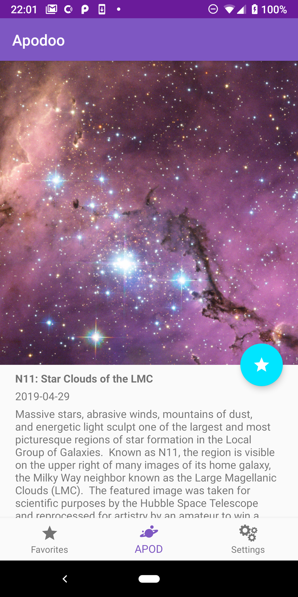

# Apodoo

This Android app allows users to fetch and view the Astronomy Picture of the Day (APOD) from NASA. The user can also save favorite apods.

### Features

* Save APODs as favorites
* fetch HD or low res version of the APOD
* Watch APOD movies

# Screenshots




# Developer Setup

## API Key

An API key from [NASA APIs](https://api.nasa.gov/api.html) is required to run this app. You must request your own API key to run this app. Place the following in a gradle.properties file, which should be placed in the project root directory:

```API_KEY="your_api_key"```

